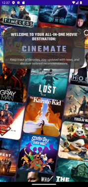
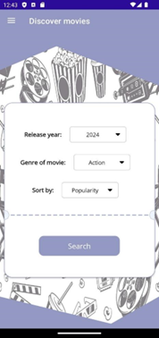
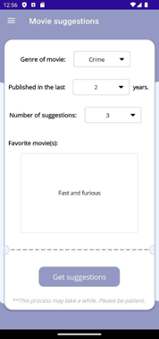
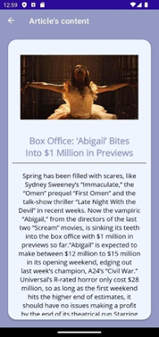

# Cinemate - Movie App

## Overview

Cinemate is a **mobile application** developed using **.NET MAUI**, designed for movie enthusiasts who want a personalized and seamless way to **discover, manage, and receive recommendations for movies**. This project was developed as a **team collaboration**, bringing together expertise in **mobile development, API integration, and AI-driven recommendations**. 

The app allows users to **browse a vast database of films, stay up to date with the latest industry news, receive AI-generated recommendations**, and organize their movie collection in a dedicated space. With a sleek and **intuitive interface**, Cinemate offers an engaging user experience across **Android, iOS, and Windows**, with a primary focus on optimizing the application for **Android and Windows** platforms.

## Features

- **Movie Discovery**: Explore a comprehensive library of movies with **detailed synopses, trailers, and ratings**.
- **Personalized Recommendations**: AI-powered suggestions based on user preferences, watch history, and ratings.
- **Industry News**: Stay informed with **real-time updates, film reviews, and exclusive news from the movie industry**.
- **Custom Movie Collection**: Create and manage a **personalized watchlist** with options to categorize and filter films.
- **User-Friendly Interface**: Smooth navigation with **dark mode support** and easy-to-use controls.
- **Cross-Platform Compatibility**: Developed with **.NET MAUI**, supporting **Android, iOS, and Windows**. This version of the application was primarily designed and optimized for **Android and Windows**, with a focus on providing the best experience on mobile platforms.
- **Offline Support**: Save selected movies and collections locally for access without an internet connection.

## Technologies Used

- **.NET MAUI** - Cross-platform mobile development.
- **REST APIs** - Fetching movie metadata, cast information, and news from external sources.
- **SQLite** - Local storage for user preferences, favorites, and offline access.
- **AI-Based Recommendation System** - Uses machine learning algorithms for personalized suggestions.
- **Web Scraping** - Collects structured data from film industry sources for news and trending updates.
- **Dependency Injection** - Efficient service and resource management within the app.
- **MVVM Architecture** - Clean and scalable structure ensuring better maintainability and modular development.

## Project Structure

- `App.xaml.cs` - Core application logic and navigation.
- `Views/` - UI components and pages for various app sections.
- `Models/` - Data models representing movies, users, and preferences.
- `Services/` - Handles API requests, data processing, and database operations.
- `Assets/` - Contains images, icons, and UI elements.

## Setup & Installation

To run Cinemate on your local machine, follow these steps:

1. **Clone the repository**:
   ```bash
   git clone https://github.com/galbinasuana/Cinemate-MovieApp.git
   ```
2. **Open the project in Visual Studio**.
3. **Ensure .NET MAUI is installed** and restore required dependencies.
4. **Run the application** on an **Android/iOS emulator or a connected physical device**.
5. **Sign in** to personalize recommendations and access your custom movie collection.
6. **Explore features** such as trending movies, curated lists, and industry updates.

## Preview

The following images showcase different aspects of the application:

### Home Screen
Displays featured movies and trending content.



### Movie Details
Detailed view of a selected movie with description, ratings, and options to add to favorites.



### Personalized Recommendations
AI-powered suggestions based on user preferences, ensuring tailored movie discovery.



### News Section
Real-time updates with the latest news, reviews, and trends from the film industry.




### Custom Movie Collection
A user-created collection where favorite movies can be saved, categorized, and accessed anytime.


